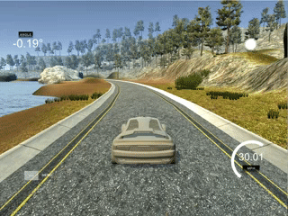
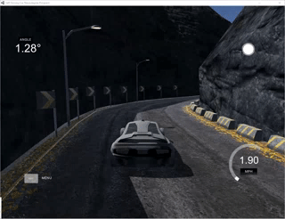

# Udacity Self-Driving-Car-Projects

# Project 1 - Detect Lane Lines
The lane detection project uses various image processing techniques to isolate the area of interest and 
detect the lane lines painted on the road.  The project introduced the concept of an image pipeline where
images are passed through and the lane line positions are extracted.  The pipeline consists of the following
stages:

* grayscale
* guassian blur
* canny transform
* region of interest processing
* hough transform

The hough transform output is processed to detect the slope of the lines.  The resulting lines are drawn
on the image.

# Project 3 - Self-Driving Car using CNN

The self-driving car using CNN project introduced Convolutional Neural Networks as applied to a control problem.  A simulator was used to generate images and steering angle.  Those images were then used to train the CNN and learn how to control the steering angle.

The first video is of a flat race track with various curves and road features.

The second video is of an off-road track with more challenging features.

# Project 4 - Advanced Lane Detection

In the advanced lane detection project was a revisit of lane detection using a different image processing approach.  Instead of using a Hough tranform, the images were perspective transformed to create parallel lines and the image searched to detect left/right lane lines.  In addition, lane center and radius of curvature was determined and overlaid on the image along with the lane polygon.

