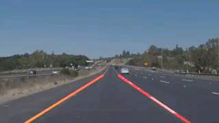

# Udacity Self-Driving-Car-Projects

# Project 1 - Detect Lane Lines
The lane detection project uses various image processing techniques to isolate the area of interest and 
detect the lane lines painted on the road.  The project introduced the concept of an image pipeline where
images are passed through and the lane line positions are extracted.  The pipeline consists of the following
stages:

* grayscale
* guassian blur
* canny transform
* region of interest processing
* hough transform

The hough transform output is processed to detect the slope of the lines.  The resulting lines are drawn
on the image.

# Project 3 - Self-Driving Car using CNN

# Project 4 - Advanced Lane Detection
